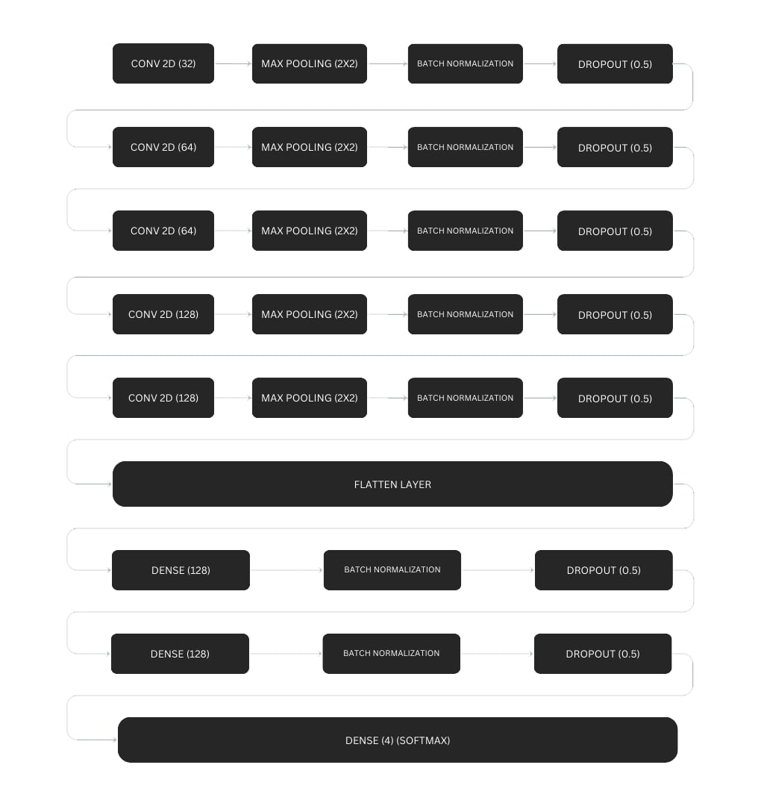

#  Brain Tumor Classifier

A deep learning project that classifies brain MRI images into four categories: **glioma tumor**, **meningioma tumor**, **pituitary tumor**, and **no tumor**. This model assists in preliminary tumor detection and classification using medical imaging.

##  Project Overview

The model was trained on a labeled dataset of brain MRI scans using a Convolutional Neural Network (CNN). It achieved a **validation accuracy of 72.06%** and helps in identifying the presence and type of tumor with reasonable accuracy.

##  Classes 

-  **Glioma Tumor**
-  **Meningioma Tumor**
-  **Pituitary Tumor**
-  **No Tumor**

## 🛠 Technologies Used

- Python
- TensorFlow / Keras
- OpenCV
- NumPy, Pandas
- Matplotlib, Seaborn (for visualization)
- Scikit-learn (for metrics and evaluation)

##  Dataset

### image dimension   
    giloma_tumor : 512 X 512  
    meningioma_tumor : 512 X 512  
    no_tumor : 350 X 350  
    pitutiary_tumor : 512 X 512  

### training dataset  
    tota_data  : 826(giloma_tumor) + 822(meningioma_tumor) + 395(no_tumor) + 827(pitutiary_tumor) = 2870 (total data point)  

### validation dataset   
    total_data  : 165(giloma_tumor) + 164(meningioma_tumor) + 79(no_tumor) + 165(pitutiary_tumor) = 573(total data point)  

##  Model Architecture

## 📊 Performance

- **Validation Accuracy:** 72.06%

## Author
Made by Nalam Deepika
### Connect on [LinkedIn](https://www.linkedin.com/in/nalamdeepika)

